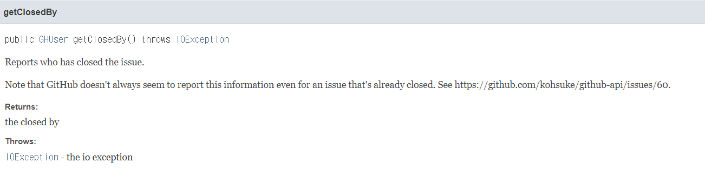

### 깃헙 repository의 comment를 활용한 출석체크

- [x] 토큰 받아 연결
- [x] 깃헙 issue받아 아이디만 분리 -> getLogin으로
- [x] 마크다운 형식으로 README 파일 만들기 (PrintWriter 설정)

1. open된 issue에 출석했다는 comment를 단 사람들의 login id를 긁어와서 출석체크 현황을 readme.md에 만든다.
 - [ ] opened되어 있는 issue가 하나 밖에 없는지 예외체크
 - [ ] comment 중복으로 달았을 경우 한번만 체크
 - [ ] comment가 있으면 
 - [ ] 주별 출석률 / 월별 출석률 확인

2. 00시가 되면 전날 issue는 closed 된다.

3. 00시가 되면 날짜에 맞는 issue가 생성된다.
- [ ] LocalDate.now() 통해서 issue title 설정
- [ ] 하나의 issue만 opened 되어 있어야 한다.

4. readme.md에는 자동으로 날짜가 추가된다.


* 추가하고 싶은 기능 : 요일 옆에 날짜 표시기능 예) 월요일(1/2)

정해야할 것
> 1. 언제 issue를 closed 되야 하는지
> 2. issue에 있는 comment를 한번에 긁어 와야함,
> 3. 월 ~ 일에 있는 comment를 한번에 긁어와 list에 boolean으로 넣어 for문 돌면서 markdown 표 형식 만들기. 
> 4. 다음 월요일이 되면 reset되어 다시 월요일 부터 시작해야함... shit

지금 할 수 있는것
> - issue를 현재 날짜에 맞게끔 title과 body 내용을 설정해 자동 생성기능
> - comment를 issue마다 가지고 올 수 있는데, issue를 가지고 오는 기준이 closed, opened, all 기준으로 가지고 올 수 있음.
> - I/O를 통해서 PrintWriter 통해서 markdown 생성해야하는데, 그 시점이 매일 스터디를 끝나는 시점을 기준으로 진행해야 한다.
> - issue를 일별로 만들어야 하는것은 확실하다. 
> - 일요일 되면 모든 issue를 closed 시키자. 그리고 opened된 모든 issue를 가져와서 요일 별로 만들자.
> - 요일별 issue를 각 id마다의 list에 boolean값으로 참석 여부를 추가하자.
> - 참석한 사람은 true로 하고, 각 날이 지날때 마다 comment가 없으면 default 값은 false로 한다.


closed 된 것을 가지고 올때
 - 다른 사람이 issue를 달 수도 있으니, 내가 닫은 것만 가지고 오기. -> 내가 닫은 기능이 정상적으로 작동 안됨.

Issue 최근 7개 돌면서 comment 마다 사람들 id를 키로, List<boolean> 참석 여부를 value로 가지는 map에 저장하기.
 - organization에서 member를 가지고 오는 것이 아니라, comment를 기준으로 가지고 오기.
 > organization을 기준으로 가지고 온다면, organization 등록되어 있지만 실제 참여 안하는 인원이 생각보다 많음.
 - comment 돌면서 map에 값이 없는 사람이 있으면 put해주는데, value인 list에 다른 사람과 동일하게 크기를 맞춰줘야함
 - 발견된 이전 까지는 list에 false값으로 세팅하기.

comment를 돌아 만든 map을 바탕으로 markdown 생성하기
 - 그냥 하면 됨.
 - 신경써야할것 : issue 생성시 body로 comment가 내 계정으로 자동 생성되는데, 나는 그럼 출석률 계산을 못하는 것인가?

string 형으로 생성한 markdown을 PrintWriter를 통해서 markdown 파일 생성하기.

 - [ ] 매일 08시에 issue 자동생성으로 만들 것.
 - [ ] 그날 생성된 issue는 당일 23시에 closed될 것.
 - [ ] 매일 23시 closed 되기 전에 markdown 형식으로 출석부를 최신화 시킬것.

그래서 생성일이 월요일 것인 issue부터 긁어 와야함. 
그리고 당일까지만 돌면서 comment check 해야함.

- [x] `23. 01. 06` update 내용: x주차 출석체크 옆에 기간 날짜로 표기하기.
- [ ] 각 user image를 삽입하는 것... 해보기
### gitignore 설정
 - [x] .idea, .gradle, out 폴더 자원 관리 배제 
 - [x] token 값과 github id를 담은 `PrivateInfo` 클래스 gitignore

### github 내부 설정
 - issue 작성 권한 나로 설정. issue closed 방지를 위한 권한 나로 설정. -> 기능이 없는것 같음.

### 23. 01. 07 배포 
 - [ ] aws lambda를 이용한 cron 기능 사용
 - [ ] shell script를 이용한 git commit 및 push 자동화

### 23. 01. 09
 - 서버를 EC2나 Elastic beanstalk를 사용해서 계속 띄우기에는 물론 무료이지만 비 효율적이라는 생각이 들었다.
 - 내가 원하는 기능은 특정 자바 파일의 메서드가 일정 시간에 실행되는 cron job을 원하는 것이다
 - 그래서 찾은 방법이 AWS에 serverless Lambda라는 기능을 찾았다.
 - 그런데 어떻게 사용하는지 정확하게 모르는 상황. event를 사용해야 하는데..
 - 그리고 java 11은 런타임을 지원하지 않는다. 어떻게 해야하지?
 - 각 issue 생성기능과 shutter기능, markdowngenerator기능을 각각의 gradle을 통해서 관리해야하는 것인지..
 - 그리고 md파일을 생성한 것을 github repository에 자동으로 push 할 수 있는지.. 고민이다.
 - 

### Trouble shooting1 

 - `Note that GitHub doesn't always seem to report this information even for an issue that's already closed`
 - 위에서 볼 수 있듯 내가 가진 issue를 분리 시키고 싶었는데, `getClosedBy`메서드를 통해서 `GHUser`를 정상적으로 불러오지 못했다.

### Trouble Shooting 2
 - aws lambda를 사용하는 과정에서 encoding 관련 한글이 깨지는 issue

### Trouble Shooting 3 (2023. 1. 15)
- 2023년 1월 15일을 3주차로 인식함. -> `WeekFields.ISO.weekOfYear()`로 변경
```java
final int weekOfYear1 = now.get(ChronoField.ALIGNED_WEEK_OF_YEAR);
final int weekOfYear2 = now.get(WeekFields.ISO.weekOfYear());
```


